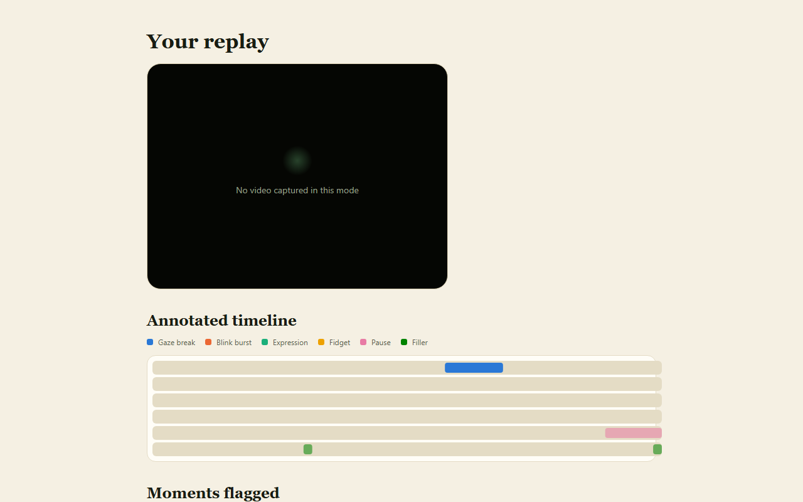
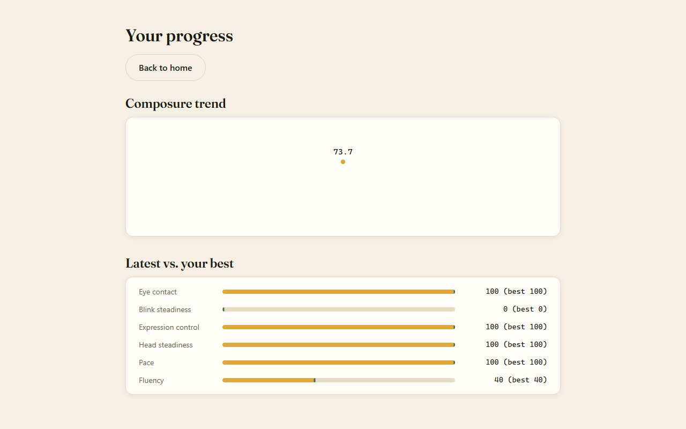
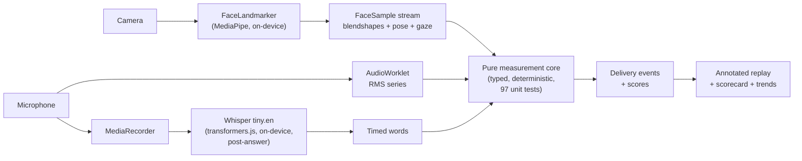

# Understudy

**Rehearse the interview. See your delivery.**

**Live: [leo-y-zhang.github.io/Understudy](https://leo-y-zhang.github.io/Understudy/)** — works in any modern desktop browser, no install, no account.

Understudy is an interview rehearsal studio that runs entirely in your
browser. Answer real admissions-interview questions on camera and get
immediate, timestamped feedback on your **delivery** — eye contact, blink
behaviour, transient expression events, head steadiness, speaking pace,
filler words, and pauses — with an annotated replay of your answer and a
score trend across practice sessions.

| | |
|---|---|
|  |  |

## Nothing you record ever leaves your device

There is no backend, no account, and no API key. Face landmarking (MediaPipe
FaceLandmarker) and speech recognition (Whisper tiny.en) run **on-device, in
the browser** — every model file is served from this site itself.

One third-party library, Google's MediaPipe, does attempt to send anonymous
performance statistics as a session ends. This page's Content-Security-Policy
pins `connect-src 'self'`, which blocks that request outright — open devtools
→ Network tab during a session and you'll see the attempt sit there marked
blocked. That's the only outbound request this app ever tries, and it never
succeeds; nothing you record is ever sent anywhere.

The CSP pins the *document's* connections to same-origin, but module workers
don't inherit a page's `<meta>` CSP — the speech worker (where transcription
actually runs) isn't covered by that `connect-src 'self'` at all. This isn't
hypothetical: building this app's real-mode test caught the transcription
library's own inference engine defaulting to fetching itself from a public
CDN inside that worker, silently, with nothing to block it. It's fixed —
that WASM runtime is vendored under `public/onnxruntime-web/` and the worker
is pointed at it explicitly (see `THIRD_PARTY.md`) — but the CSP had no part
in catching or fixing it. The worker's isolation instead rests on
`@huggingface/transformers` being configured to never fetch remotely
(`env.allowRemoteModels = false`) plus every model and runtime file being
fully vendored — and a real-mode Playwright test in CI drives an actual
recording + transcription end to end and asserts zero successful off-origin
requests, not just a policy that should prevent them.

**Verify it yourself:** open devtools → Network tab → record a full session.
Every request that *succeeds* stays on this site's origin.

Recordings and scores live only in your browser (in-memory; saved history in
IndexedDB, opt-in per session for video). The dashboard has one-click export
(JSON, metrics only) and a full wipe.

## How it works



The measurement core is pure TypeScript — time-series in, events and scores
out, no DOM, no I/O — which makes every detector unit-testable against
synthetic fixtures. What it measures:

| Signal | From | Reported as |
|---|---|---|
| Eye contact | iris + head pose | contact %, timestamped gaze breaks |
| Blink behaviour | eye blendshapes | blinks/min, blink bursts |
| Expression events | brow/lip/smile blendshapes vs rolling baseline | brief expression events |
| Head steadiness | pose matrix motion | fidget index, restless spans |
| Pace | word timestamps | WPM + variability |
| Fluency | transcript + voice activity | filler words, long pauses |

Six sub-scores combine into a single **Composure** score you can track
across sessions.

## Honest limits

Understudy measures observable delivery signals only. It does **not** detect
emotions, truthfulness, confidence, or ability, and it never will — that is
permanent product policy, not a roadmap gap. Scores are heuristics for
comparing your own practice sessions on the same setup; they are not
comparisons against other people or against any norm. Landmark models behave
differently across faces, lighting, and cameras — trends are meaningful,
absolute numbers are not. Word-level timings are estimated within the
transcribed segment boundaries, so filler timestamps are approximate. Filler
counting matches a fixed word list (`um`, `uh`, `like`, `you know`, and
similar) rather than judging intent, so it will flag every occurrence of a
word like "like", including grammatically legitimate ones ("I like this
question") — it cannot tell those apart from the filler.

## Development

```bash
npm ci
npm run dev          # local dev server
npm run test:unit    # 97 unit tests
npm run test:e2e     # Playwright journeys incl. the zero-network guarantee + axe a11y scan
npm run test:integration  # real Whisper transcription of a synthetic-voice fixture (local only)
npm run build        # production build (deployed to GitHub Pages by CI)
```

Stack: Vite + TypeScript (strict), no UI framework. `src/core/` is the pure
measurement layer; `src/capture/` wraps camera/mic/MediaPipe; `src/speech/`
runs Whisper in a Web Worker; `src/ui/` is hand-rolled accessible DOM.
Model assets are vendored via `scripts/fetch-assets.mjs` with pinned sources
and hashes — see [THIRD_PARTY.md](THIRD_PARTY.md).

## Licence

[MIT](LICENSE). Model weights and runtime licences are listed in
[THIRD_PARTY.md](THIRD_PARTY.md).
